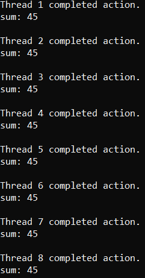

# Отчет

## Задача

Целью программы является имитация ситуации, в которой несколько потоков одновременно пытаются получить доступ к общему ресурсу, представленному в виде массива. Для обеспечения безопасного доступа используются мьютексы, а условные переменные позволяют потокам ожидать определенных условий, например, чтобы дождаться своей очереди на доступ к ресурсу.

## Используемые механизмы

- **Мьютексы (`std::mutex`):** Обеспечивают эксклюзивный доступ к общему ресурсу (массиву `sharedArr`), предотвращая конфликты при одновременном доступе из разных потоков.

- **Условные переменные (`std::condition_variable`):** Используются для ожидания определенных условий перед доступом к общему ресурсу. Каждый поток ожидает своей очереди на выполнение вычислений на массиве.

## Программная реализация

Программа создает несколько потоков, каждый из которых вычисляет сумму массива. Потоки синхронизированы с использованием мьютексов и условных переменных. После завершения вычислений каждый поток выводит результаты, сообщает о завершении своего действия и передает управление следующему потоку.

## Вывод

Каждый поток выполняет вычисления на массиве в правильной последовательности, сообщает о завершении своего действия и передает управление следующему потоку, обеспечивая корректное взаимодействие между потоками при доступе к общему ресурсу.

## Результат программы

